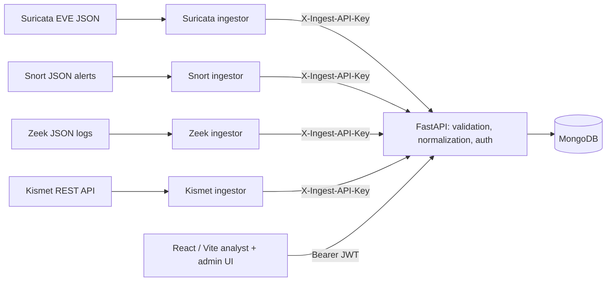

# IntruSight

**A multi-engine network intrusion detection alert management platform.** IntruSight
centralizes and normalizes telemetry from Suricata, Snort, Zeek, and Kismet into one
analyst workflow — without flattening what makes each engine useful.

> Built by a seven-member final-year university project team. This repository preserves
> the original contributors and Git history and must not be read as a solo project.
> See [Team and attribution](#team-and-attribution).

## Live demo

| | |
| --- | --- |
| **Frontend** | <https://intrusight-app.netlify.app> |
| **Backend API** | <https://intrusight.onrender.com> — [`/docs`](https://intrusight.onrender.com/docs) · [`/health`](https://intrusight.onrender.com/health) |
| **Data** | MongoDB Atlas |

This is a **public portfolio deployment**, not enterprise production infrastructure. The
backend runs on Render's free tier, so the first request after a period of inactivity
may take up to a minute while the instance cold-starts — load the backend health URL
first if the frontend looks unresponsive.

The landing, features, and demo pages are public. Analyst and administrator views require
an account: registration creates a `pending` user, and an administrator activates it
before login succeeds.

## What IntruSight does

Four detection and monitoring engines produce records in four different formats, with
four different ideas of what an "event" is. IntruSight ingests those records through
per-engine Python ingestors, normalizes the fields that genuinely share meaning,
preserves the ones that do not, and presents the result as a single queue that analysts
can filter, triage, annotate, and track.

**What it is not:**

- **Not a packet capture tool** — IntruSight never touches a network interface.
- **Not a replacement for an IDS engine** — Suricata, Snort, Zeek, and Kismet do the detection.
- **Not a SIEM** — no log aggregation, correlation engine, or long-term retention tier.
- **Not a rule-authoring or rule-distribution platform.**
- **Not production infrastructure** — this is an educational engineering prototype.

## Why four engines

The interesting problem is not connecting to four tools. It is that the four tools **do
not report the same kind of thing**, and forcing them into one alert shape destroys what
each is good for.

| Engine | Answers | Contributes | Primary record kind |
| --- | --- | --- | --- |
| **Suricata** | "Did this match a known pattern?" | Signature detections with rule identity | `detection` |
| **Snort** | "Did this match *our* rule?" | Operator-authored rule detections | `detection` |
| **Zeek** | "What did this connection actually do?" | Protocol and connection context | `observation` (notices are detections) |
| **Kismet** | "What is present on the air?" | Wireless device and AP visibility | `observation` (WIDS alerts are detections) |

Suricata and Snort assert that traffic matched a rule. Zeek mostly does not accuse
traffic of anything — it describes it, which is exactly what an analyst needs once a
signature has fired. Kismet sees a layer the other three cannot observe at all.

## Detection vs observation

Every record carries an `event_kind`, and the distinction runs through ingestion,
storage, and the UI:

- **`detection`** — an engine asserts that traffic matched a rule. Severity is graded on
  a shared scale (`1` high, `2` medium, `3` low) enforced by the API model.
- **`observation`** — an engine describes what it saw. **Not graded**, because the engine
  made no assessment and IntruSight will not invent one.

Supporting fields keep engine-native meaning intact instead of discarding it:

| Field | Purpose |
| --- | --- |
| `observation_type` | What an observation is (`connection`, `dns_query`, `http_request`, `tls_handshake`, `wireless_ap`, `wireless_client`) |
| `engine_context` | Engine-native fields with no shared column — Zeek's connection state, Kismet's SSID/channel/encryption, Suricata's application protocol |
| `source_asset` / `destination_asset` / `asset_kind` | Canonical endpoints. Wired engines use `ip`; Kismet reports 802.11 hardware addresses as `mac` |
| `source_nids` | Which engine produced the record |

Because `asset_kind` distinguishes the endpoint type, Kismet's MAC addresses stay out of
the IP fields, and geolocation is skipped outright for `mac` records. The legacy
`src_ip`/`dest_ip` fields remain populated for IP-based engines, so existing readers and
filters are unaffected.

## Architecture



1. An engine emits an engine-specific record.
2. Its Python ingestor classifies it, normalizes endpoints, summary, category and — for
   detections only — severity, and preserves engine-native fields in `engine_context`.
3. The ingestor posts the payload to `/api/ingest/alerts` with a dedicated ingestion key.
4. FastAPI validates and stores it, reconciles asset and IP fields, and enriches IP
   endpoints with GeoLite2 data.
5. Authenticated analysts filter, annotate, and update records — by engine and by record kind.

IntruSight performs no detection of its own. Every detection in the queue was made by an
external engine.

## Key features

- Multi-engine ingestion with a shared normalized record model and per-engine parsers
- Detection/observation classification, severity mapping, and engine-context preservation
- Alert filtering, status tracking, analyst notes, and GeoLite2 geolocation
- Analyst dashboards, alert queue, traffic views, reports, and threat map
- Administrator workflows: account approval, role and status management, log sources, database maintenance
- Bcrypt password hashing, expiring JWTs, active-account enforcement, server-side session invalidation
- Separate API-key authentication for machine-to-machine ingestion
- Deterministic demo loader that replays engine-shaped fixtures through the real ingestors
- Development simulators for each engine, for when a sensor or wireless interface is unavailable

## Demo dataset

A deterministic corpus of hand-authored, engine-shaped fixtures lives in
[`demo/fixtures/`](demo/fixtures/). The loader replays them through the **real ingestors**
and posts to the normal ingestion endpoint — the same parsing code that runs against a
live sensor.

| Engine | Detections | Observations | Total |
| --- | ---: | ---: | ---: |
| Suricata | 4 | 0 | 4 |
| Snort | 4 | 0 | 4 |
| Zeek | 1 | 6 | 7 |
| Kismet | 2 | 4 | 6 |
| **Total** | **11** | **10** | **21** |

All four engines describe the same lab window from their own vantage point, and the
correlation is real rather than asserted: the Zeek records share the 5-tuple and
connection `uid` of the connections Suricata alerted on. Kismet's records are
deliberately *not* correlated with the wired traffic, because the lab has no evidence
linking them.

**Provenance is explicit.** Every loaded record is tagged
`engine_context.provenance = "replayed-fixture"`, shown as a banner in the analyst detail
view, and `clear` removes exactly those records and nothing else. These fixtures are
**not** live captured attacks, not production telemetry, and not proof that four real
engines simultaneously detected the same activity. Simulator output is likewise
distinguishable and is synthetic lab data.

See [`demo/README.md`](demo/README.md) for the full scenario and provenance table, and
[`demo/DEMO_GUIDE.md`](demo/DEMO_GUIDE.md) for a five-minute walkthrough.

## Tech stack

| Layer | Technologies |
| --- | --- |
| Backend | Python 3.12, FastAPI, Pydantic, Uvicorn |
| Data | MongoDB (Motor for async workflows, PyMongo for the alert collection) |
| Frontend | React, Vite, React Router, Axios, Recharts, Leaflet |
| Security | bcrypt, signed JWT bearer tokens, ingestion API keys |
| Enrichment | MaxMind GeoLite2 City |
| Testing | pytest, pytest-asyncio, FastAPI TestClient, ESLint, Vite build |
| Deployment | Netlify (frontend), Render (backend), MongoDB Atlas |

## Security model

Two distinct trust paths, deliberately separated:

| Path | Credential | Used by |
| --- | --- | --- |
| Human application access | Signed, expiring **JWT** bearer token | Analyst and administrator UI |
| Machine ingestion | **`X-Ingest-API-Key`** header | The four Python ingestors |

Supporting controls: bcrypt password hashing, active-account enforcement at login,
server-side session invalidation, administrator approval before a new account can
authenticate, and **explicit CORS** — the API refuses to start with a wildcard origin and
allows only `Authorization`, `Content-Type`, and `X-Ingest-API-Key` headers.

An earlier Telegram alert-forwarding integration has been removed from the codebase, and
[`backend/tests/test_telegram_containment.py`](backend/tests/test_telegram_containment.py)
asserts it stays removed. Any credential appearing in this project's Git history should
be treated as compromised and already revoked.
[`SECURITY_AUDIT.md`](SECURITY_AUDIT.md) records the remediation, rotations, and
validation results. Perform a fresh threat model before running this against production
network data.

## Local development

**Requirements:** Python 3.12+, Node.js 22+, MongoDB 8.x (local or remote). Optionally
Docker Compose for the bundled MongoDB service, a GeoLite2 City database, and Kismet
credentials.

### Backend

```bash
python3 -m venv backend/.venv
source backend/.venv/bin/activate
python -m pip install -r backend/requirements.txt
cp .env.example backend/.env
```

Generate independent values for `SECRET_KEY` and `INGEST_API_KEY`, replace the
placeholders in `backend/.env`, and restrict the file:

```bash
openssl rand -hex 32   # SECRET_KEY
openssl rand -hex 32   # INGEST_API_KEY (never reuse the first value)
chmod 600 backend/.env
```

`backend/.env` is gitignored and loaded automatically by the API and backend scripts.

### MongoDB

IntruSight does not start MongoDB itself and has no in-memory fallback. Either use the
repository's compose service:

```bash
docker compose -f backend/docker-compose.test.yml up -d
```

…or a local install (`brew services start mongodb-community@8.0`), then verify:

```bash
mongosh "mongodb://localhost:27017/admin" --quiet --eval 'db.runCommand({ ping: 1 }).ok'   # → 1
```

For a hosted deployment, put the private connection URI in `backend/.env` — never in a
tracked file. Create the first administrator interactively (hidden password prompt):

```bash
cd backend && python create_admin.py
```

### Frontend

```bash
cd frontend
cp .env.example .env
npm ci
npm run dev
```

### Run both

```bash
# terminal 1
cd backend && source .venv/bin/activate && uvicorn main:app --reload --host 127.0.0.1 --port 8000

# terminal 2
cd frontend && npm run dev
```

The UI is served at <http://localhost:5173>; API health and interactive docs at
`/health` and `/docs` on port 8000. The health response always reports process liveness
with `ok: true` — use `ready` and `checks.mongodb` to see whether MongoDB actually
answered a ping.

To run an ingestor against real engine output, set its input path plus `API_URL` and
`INGEST_API_KEY`, then run the script from `backend/` (for example
`python eve_ingestor.py`).

### Environment variables

| Variable | Purpose | Notes |
| --- | --- | --- |
| `MONGODB_URL` | MongoDB connection URI | Startup fails if unset |
| `SECRET_KEY` | JWT signing secret, 32+ characters | Startup fails if unset or a placeholder |
| `INGEST_API_KEY` | Independent key for the ingestion endpoint | Ingestion returns 503 if unset |
| `DATABASE_NAME` | Shared database name | Defaults to `siemless_db` |
| `CORS_ORIGINS` | Comma-separated browser origins | Defaults to `http://localhost:5173` |

Ingestors read `API_URL`, `INGEST_API_KEY`, `SEVERITY_THRESHOLD`, and an engine-specific
input path (`SURICATA_EVE_PATH`, `SNORT_ALERT_PATH`, `ZEEK_LOG_FILE`; the older shared
`ALERTS_FILE_PATH` is still honoured as a fallback). Remaining optional variables
configure token expiry, Kismet, GeoLite2, and the private backup directory. The frontend
reads `VITE_API_BASE` from `frontend/.env`.

Never commit a populated `.env`, a MaxMind license key, a Kismet key, or a production
MongoDB URI. The GeoLite2 database is intentionally not committed — download a current
`GeoLite2-City.mmdb` to `backend/geoip/` or set `GEOIP_DB_PATH`. Geolocation is
approximate and must not be used to identify a household or individual.

## Demo workflow

With the backend, MongoDB, and `INGEST_API_KEY` configured:

```bash
python3 backend/tools/demo.py load     # replay all four engines through the real ingestors
python3 backend/tools/demo.py status   # what is currently loaded
python3 backend/tools/demo.py clear    # remove only what the loader added
```

`load --engine zeek` replays a single engine. The loader never writes to MongoDB directly
and never generates records.

## Testing

Backend — the suite currently collects **287 tests** (API routes, auth, ingestors, engine
role classification, config validation, and security-remediation assertions):

```bash
docker compose -f backend/docker-compose.test.yml up -d
cd backend && source .venv/bin/activate && pytest
```

Frontend:

```bash
cd frontend && npm ci && npm run lint && npm run build
```

## Team and attribution

IntruSight was built by a **seven-member final-year university project team**. The
original Git history and contributor attribution are intentionally preserved. Features
described here were delivered collaboratively; repository ownership or hosting by one
contributor does not imply sole authorship.

### My contributions

Git history under the `LongTongg16` identity directly supports the following:

- Alert ingestion and retrieval API endpoints
- Request validation, filtering, status handling, and ingestion error handling
- Python ingestors for Suricata, Snort, Zeek, and Kismet
- Normalization of engine-specific fields and severity mapping onto the shared scale
- Simulators for engines and interfaces unavailable during development
- Connecting the multi-engine ingestion path to the FastAPI backend

Other project areas — dashboard work, deployment, and database migration among them —
are not claimed here, because the preserved Git history does not unambiguously attribute
them to this contributor.

## Limitations

Honest and current, as of this release:

- The public deployment runs on Render's free tier; cold starts after inactivity are expected.
- JWTs are stored in browser local storage, so frontend XSS prevention remains important.
- The ingestors are single-process prototypes with no durable queue, replay protection, or delivery guarantee.
- No centralized rate limiting and no enterprise-grade audit logging.
- No self-service email password reset (administrators perform resets) and no production-grade MFA.
- No IDS rule editor, packet capture, or full sensor lifecycle management.
- GeoLite2 enrichment is optional and approximate.
- The backend mixes Motor (async) and PyMongo (sync) access paths.
- Some network-traffic rows are explicitly seeded demo data.
- Prototype-scale deployment: sized for demonstration, not for sustained production load.

## Roadmap

Durable ingestion queues with idempotency keys and per-sensor credentials; rate limiting
and structured security audit events; automated dependency and secret scanning;
end-to-end browser tests; secure password-reset delivery and optional MFA; production
observability and restore drills.
