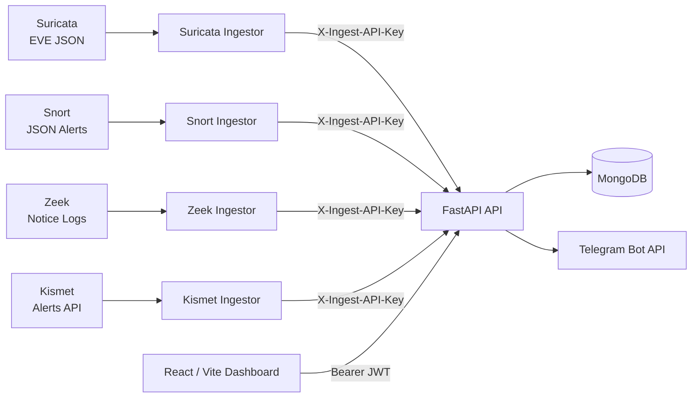

# IntruSight

## Multi-Engine Network Intrusion Detection & Alert Management Platform

IntruSight is a full-stack cybersecurity platform for **collecting, normalizing, reviewing, and managing alerts from multiple network intrusion detection systems**.

It integrates **Suricata, Snort, Zeek, and Kismet** through dedicated Python ingestion workers, transforms engine-specific events into a shared alert model, stores them in MongoDB through a FastAPI backend, and presents them through a React dashboard for analyst and administrator workflows.

> **Project context:** IntruSight was developed as a seven-member final-year university team project. This repository preserves the original contributors and Git history and should not be interpreted as a solo project.


---

## What Problem Does IntruSight Solve?

Network monitoring environments often rely on multiple security tools.

Each tool produces different event formats, fields, severity values, and alert structures. This makes it harder to create a consistent workflow for reviewing security events.

IntruSight explores how alerts from different network-security engines can be transformed into a **shared operational view**.

It integrates:

- **Suricata** — network intrusion detection and prevention
- **Snort** — signature-based intrusion detection
- **Zeek** — network security monitoring and event analysis
- **Kismet** — wireless network monitoring and detection

IntruSight does **not** replace these engines or capture packets itself.

Instead, the IDS engines generate the security telemetry, while IntruSight acts as the aggregation, normalization, storage, and investigation layer.

---

# Key Features

## Multi-Engine Alert Ingestion

IntruSight includes dedicated Python ingestors for:

- Suricata EVE JSON
- Snort JSON alerts
- Zeek notice logs
- Kismet Alerts API

Each ingestor extracts selected security fields and converts the engine-specific event into a shared structure that the backend can process consistently.

---

## Alert Normalization

Different security engines describe events differently.

The ingestion layer normalizes selected information including:

- source address
- destination address
- network identifiers
- alert signature
- category
- severity
- originating security engine

This means events from several detection technologies can move through the same investigation workflow.

---

## Centralized Security Dashboard

The React dashboard provides analysts with a single interface for reviewing collected security events.

Supported workflows include:

- alert review
- filtering
- alert-detail inspection
- status tracking
- investigation notes
- traffic views
- reports
- geographic threat visualization
- Telegram alert delivery

---

## Role-Aware Workflows

IntruSight separates analyst and administrator functionality.

### Analyst

Analysts can work with:

- alerts
- filters
- investigation notes
- alert status
- dashboards
- reports
- traffic views
- threat maps

### Administrator

Administrators can manage:

- user approval
- account state
- log sources
- database maintenance

---

## Authentication & Access Control

The application includes:

- bcrypt password hashing
- signed JWT bearer tokens
- token expiration
- active-account validation
- role-aware authorization
- server-side session invalidation
- dedicated API-key authentication for machine-to-machine ingestion

Human users and IDS ingestion workers therefore use separate authentication mechanisms.

---

# Architecture



The backend currently uses:

- **Motor** for asynchronous account and maintenance workflows
- **PyMongo** for the synchronous alert collection

---

# Alert Data Flow

```text
IDS / Network Monitor
        ↓
Engine-Specific Security Event
        ↓
Python Ingestor
        ↓
Field Extraction
        ↓
Normalization
        ↓
Authenticated Ingestion Request
        ↓
FastAPI
        ↓
Validation
        ↓
MongoDB
        ↓
Analyst Dashboard
```

In practice:

1. An IDS engine or simulator produces an event.
2. Its Python ingestor extracts relevant fields.
3. Engine-specific values are normalized.
4. The ingestor sends the result to `/api/ingest/alerts` using `X-Ingest-API-Key`.
5. FastAPI validates and stores the alert.
6. IP addresses can optionally be enriched using GeoLite2.
7. Medium- and high-severity alerts can trigger Telegram notifications.
8. Authenticated analysts can retrieve, filter, annotate, and update the alerts.

---

# Supported Detection Engines

| Engine | Input | Integration |
| --- | --- | --- |
| Suricata | EVE JSON alert events | `backend/eve_ingestor.py` |
| Snort | JSON alert output | `backend/snort_ingestor.py` |
| Zeek | JSON notice records | `backend/zeek_ingestor.py` |
| Kismet | Kismet Alerts API | `backend/kismet_ingestor.py` |

Development simulators for all four engines are also included under `backend/`.

These generate synthetic lab data when:

- an IDS engine is unavailable
- a compatible wireless interface is unavailable
- suitable attack traffic is unavailable
- reproducible development data is required

Simulator output is test data and should **not** be represented as real captured attacks.

---

# Technology Stack

### Backend

- Python
- FastAPI
- Pydantic
- Uvicorn

### Data

- MongoDB
- Motor
- PyMongo

### Frontend

- React
- Vite
- React Router
- Axios
- Recharts
- Leaflet

### Security

- bcrypt
- JWT bearer authentication
- role-aware authorization
- ingestion API keys

### Security Integrations

- Suricata
- Snort
- Zeek
- Kismet
- Telegram Bot API
- MaxMind GeoLite2 City

### Testing

- pytest
- pytest-asyncio
- FastAPI TestClient
- ESLint
- Vite production build

---

# My Contribution

IntruSight was built collaboratively by a **seven-member final-year university project team**, so I do not claim sole ownership of the platform.

My preserved Git history directly supports primary contributions to the **multi-engine alert-ingestion pipeline and backend integration**.

My work included:

- designing and implementing alert-ingestion and retrieval endpoints
- building and refining Python ingestors for **Suricata, Snort, Zeek, and Kismet**
- extracting engine-specific security-event fields
- normalizing event structures and severity values
- implementing validation and ingestion error handling
- adding filtering and alert-status handling
- creating and refining simulators when security engines or suitable lab traffic were unavailable
- connecting the multi-engine ingestion pipeline to the FastAPI backend

The strongest technical challenge in this work was not simply receiving JSON.

Each security engine exposes telemetry differently, so the ingestion layer had to translate heterogeneous security events into a common format that downstream application components could process consistently.

---

# What I Learned

## 1. Security Tools Do Not Share a Common Data Model

Suricata, Snort, Zeek, and Kismet expose different concepts and event structures.

Integrating them required understanding each source independently before deciding which information could be represented consistently.

This made **security telemetry normalization** one of the central engineering problems in the project.

---

## 2. Simulators Can Remove Infrastructure Bottlenecks

Security development often depends on external conditions:

- IDS installations
- compatible network interfaces
- test traffic
- reproducible alerts

Developing simulators allowed us to work on the ingestion pipeline even when those dependencies were unavailable.

It also reinforced the importance of clearly distinguishing **synthetic test data from captured security evidence**.

---

## 3. A Security Platform Must Secure Itself

A system that processes security alerts can still contain serious application-security weaknesses.

A later review of IntruSight identified issues involving:

- authentication
- authorization
- secrets management
- API access control
- sensitive data
- session invalidation
- CORS
- input handling
- dependency hygiene

That reinforced a simple but important lesson:

> Building security software does not automatically make the software secure.

---

# Security Review & Hardening

A dedicated security review was performed across:

- authentication
- authorization
- integrations
- configuration
- sensitive files
- dependencies
- maintenance functionality
- deployment assumptions

The review identified issues including:

- public administrator-role registration
- inactive accounts receiving usable authentication tokens
- unsafe JWT secret fallback behavior
- unauthenticated alert operations
- public alert ingestion
- hardcoded integration credentials
- sensitive database backups committed to the repository
- inconsistent session invalidation
- overly permissive CORS configuration
- maintenance path traversal
- excessive error disclosure
- unnecessary and outdated dependencies

Remediation included:

- restricting public registration
- active-account enforcement
- stronger JWT validation
- server-side token invalidation
- role-aware authorization
- dedicated ingestion API-key authentication
- environment-based secret handling
- stricter CORS policy
- validated maintenance filenames
- safer error handling
- dependency cleanup

The complete review is documented in:

[`SECURITY_AUDIT.md`](SECURITY_AUDIT.md)

---

# Testing & Validation

## Backend

The documented security-remediation validation reports:

**141 passing backend tests**

Run the suite with:

```bash
docker compose -f backend/docker-compose.test.yml up -d
cd backend
source .venv/bin/activate
pytest
```

A syntax/import validation was also performed:

```bash
python -m compileall -q backend
```

The backend tests cover areas including authentication, authorization, alert handling, ingestion, and application behavior.

---

## Frontend

```bash
cd frontend
npm ci
npm run lint
npm run build
```

The documented validation reports successful:

- ESLint checks
- Vite production build

---

# Local Setup

## Requirements

- Python 3.12+
- Node.js 22+
- npm
- MongoDB 8.x

Optional:

- Docker Compose
- GeoLite2 City
- Telegram credentials
- Kismet credentials

---

## Clone the Repository

```bash
git clone https://github.com/LongTongg16/intrusight.git
cd intrusight
```

---

## Backend

Create a virtual environment:

```bash
python3 -m venv backend/.venv
source backend/.venv/bin/activate
```

Install dependencies:

```bash
python -m pip install -r backend/requirements.txt
```

Create the backend environment file:

```bash
cp .env.example backend/.env
```

Generate independent values for the application JWT secret and ingestion key:

```bash
openssl rand -hex 32
openssl rand -hex 32
```

Use separate values for:

```text
SECRET_KEY
INGEST_API_KEY
```

Never reuse these credentials across services.

---

# Environment Variables

Required backend variables include:

| Variable | Purpose |
| --- | --- |
| `MONGODB_URL` | MongoDB connection URI |
| `DATABASE_NAME` | MongoDB database name |
| `SECRET_KEY` | JWT signing secret |
| `INGEST_API_KEY` | Machine-to-machine ingestion key |
| `CORS_ORIGINS` | Allowed browser origins |

Optional configuration includes:

- token expiry
- Telegram integration
- Kismet
- GeoLite2
- log locations
- backup directories

The frontend reads:

```text
VITE_API_BASE
```

from `frontend/.env`.

Never commit:

- populated `.env` files
- Telegram tokens
- Kismet API keys
- MaxMind license keys
- production MongoDB URIs
- JWT secrets
- ingestion keys

---

# MongoDB

Start the included local MongoDB service:

```bash
docker compose -f backend/docker-compose.test.yml up -d
```

For a fresh database, create the first administrator:

```bash
cd backend
python create_admin.py
```

The administrator script uses a hidden password prompt to avoid exposing the password in shell history.

---

# Running Locally

## Backend

```bash
cd backend
source .venv/bin/activate
uvicorn main:app --reload --host 127.0.0.1 --port 8000
```

API documentation:

```text
http://localhost:8000/docs
```

Health endpoint:

```text
http://localhost:8000/health
```

---

## Frontend

```bash
cd frontend
cp .env.example .env
npm ci
npm run dev
```

Open:

```text
http://localhost:5173
```

---

# Running an Ingestor

Configure the relevant event source together with:

```text
API_URL
INGEST_API_KEY
```

Then run the appropriate ingestor.

Example — Suricata:

```bash
cd backend
source .venv/bin/activate
python eve_ingestor.py
```

Equivalent workers are included for Snort, Zeek, and Kismet.

---

# GeoLite2

GeoLite2 is used for optional geographic enrichment.

The database itself is intentionally not committed.

Download a current `GeoLite2-City.mmdb` from MaxMind and place it at:

```text
backend/geoip/GeoLite2-City.mmdb
```

Alternatively, configure:

```text
GEOIP_DB_PATH
```

See:

- [MaxMind GeoLite2 documentation](https://dev.maxmind.com/geoip/geolite2-free-geolocation-data/)
- [MaxMind database update guidance](https://dev.maxmind.com/geoip/updating-databases/)

GeoIP information is approximate and should not be used to identify a household or individual.

---

# Current Limitations

IntruSight remains an educational prototype rather than a production SOC platform.

Current limitations include:

- no built-in packet capture
- no IDS rule editor
- no sensor lifecycle management
- single-process ingestion workers
- no durable ingestion queue
- no replay protection
- shared ingestion credentials rather than per-sensor identities
- no rate limiting
- no centralized security audit logging
- no self-service email password reset
- JWT storage in browser local storage
- optional and approximate GeoLite2 enrichment
- some explicitly seeded demonstration traffic
- no verified current production deployment

IntruSight should therefore not be presented as:

- a SIEM replacement
- a production SOC platform
- an IDS engine
- a packet-capture system

---

# Future Improvements

Potential improvements include:

- durable ingestion queues
- idempotency keys
- replay protection
- sensor-specific credentials
- structured security audit logging
- rate limiting
- broader authorization tests
- end-to-end browser testing
- automated secret scanning
- automated dependency scanning
- multi-factor authentication
- secure password-reset delivery
- production observability
- backup encryption
- tested restore procedures

---

# Deployment

No deployment credentials or provider state are stored in the current repository.

For a future deployment:

1. Provision MongoDB.
2. Configure backend secrets through the hosting environment.
3. Restrict `CORS_ORIGINS` to the exact HTTPS frontend origin.
4. Run FastAPI behind TLS and a production process supervisor.
5. Build the frontend with the correct HTTPS `VITE_API_BASE`.
6. Keep database backups and GeoLite2 data in private persistent storage.
7. Rotate secrets independently.

Earlier project documentation referenced Netlify and Render deployments.

Treat those deployments as historical unless their current ownership and maintenance status have been verified.

---

# Security Considerations

The current tracked repository was remediated to remove committed credentials, account backups, generated archives, and the bundled GeoLite2 database.

Sensitive application routes now require either:

- authenticated user access using JWTs, or
- the dedicated ingestion API key

However, historical Git objects require separate consideration.

See [`SECURITY_AUDIT.md`](SECURITY_AUDIT.md) for:

- confirmed findings
- remediation details
- credential-rotation requirements
- residual risks
- Git-history cleanup recommendations
- validation results

A fresh threat model and deployment-security review should be performed before the platform is used with production network data.

---

# Team Attribution

IntruSight was built by a **seven-member final-year university project team**.

The original Git history and contributor attribution are intentionally preserved.

Repository ownership or hosting by one contributor does **not** imply sole authorship.

Features across the overall application were delivered collaboratively.

My independently attributable work is documented in the **My Contribution** section above.

---

# Responsible Use

IntruSight is an educational and defensive cybersecurity project.

It is intended to explore:

- intrusion-detection integration
- security telemetry normalization
- backend alert ingestion
- analyst workflows
- security-platform engineering

Synthetic alerts included for development are test data and must not be represented as real detected attacks.

The project should undergo a fresh threat model and deployment review before handling sensitive or production network telemetry.
