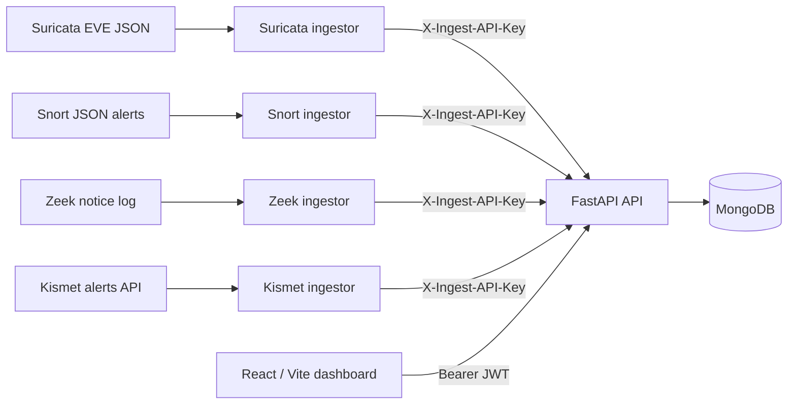

# IntruSight

## Multi-Engine Network Intrusion Detection and Alert Management Platform

IntruSight is a full-stack dashboard for collecting, normalizing, reviewing, and
managing alerts from multiple network intrusion detection systems. It combines a
FastAPI API, MongoDB persistence, Python ingestion workers, and a React dashboard
with role-aware analyst and administrator workflows.

> This was developed as a seven-member final-year university team project. This
> repository preserves the original contributors and Git history and must not be
> interpreted as a solo project.

## What IntruSight is, and what it is not

**It is** an educational engineering prototype: a FastAPI service backed by
MongoDB, a React/Vite dashboard, and four Python ingestors that normalize
Suricata, Snort, Zeek, and Kismet events into one shared alert representation.
Human users authenticate with JWTs; machine ingestion authenticates with a
separate `X-Ingest-API-Key`.

**It is not:**

- a packet capture tool — IntruSight never touches a network interface;
- a replacement for an IDS engine — Suricata, Snort, Zeek, and Kismet do the detection;
- a SIEM — there is no log aggregation, correlation engine, or long-term retention tier;
- a rule-authoring or rule-distribution platform;
- a production system. There is no currently verified public production
  deployment, and none should be inferred from this repository.

Simulator output and the seeded network-traffic rows are synthetic demo data and
must never be presented as captured evidence.

## Telegram is not a maintained integration

Earlier versions of this project pushed high-severity alerts to a Telegram bot.
**That integration has been removed from the current codebase.** The bot identity
historically associated with the project is no longer under the team's control
and is not trusted, so the alert pipeline must have no path to it.

Concretely, in the current code: there is no Telegram sender, no
`/api/alerts/send-telegram` route, no Telegram side effect during alert
ingestion, no `TELEGRAM_BOT_TOKEN` configuration variable, and no `telegram_id`
field on any API model or profile form. `backend/tests/test_telegram_containment.py`
asserts these properties. Existing MongoDB user documents may still hold a stored
`telegram_id` from that era; current code never reads or writes it, and purging it
is a separate operator decision.

Treat any historical Telegram credential in this project's Git history as
compromised and already revoked.

Screenshots and a narrated demo can be added here when a stable public demo
environment is available. No screenshot is committed at present.

## Project context

The project explored a simpler operational view over alerts produced by
Suricata, Snort, Zeek, and Kismet. The application does not capture packets or
replace an IDS engine: those engines produce events, and IntruSight ingests and
normalizes selected alert fields for investigation.

The team tested custom Suricata and Snort rules as part of the alert pipeline.
IntruSight is not a rule-authoring or rule-distribution system.

## Key features

- Multi-engine alert ingestion with a shared normalized alert model
- Severity mapping, alert filtering, status tracking, notes, and geolocation
- Analyst dashboards, traffic views, reports, and threat maps
- Administrator workflows for account approval, log sources, and database maintenance
- Bcrypt password hashing, expiring JWTs, active-account checks, and server-side session invalidation
- API-key authentication dedicated to machine-to-machine alert ingestion
- Simulators for development where an IDS engine, wireless interface, or lab traffic is unavailable

## Architecture



The API currently uses Motor for asynchronous account and maintenance workflows
and PyMongo for the synchronous alert collection.

## Why four engines

The interesting problem in this project is not connecting to four tools. It is
that the four tools **do not report the same kind of thing**, and forcing them
into one alert shape destroys what each is good for.

| Engine | Answers | Contributes | Record kind |
| --- | --- | --- | --- |
| **Suricata** | "Did this match a known pattern?" | Signature detections with rule identity | `detection` |
| **Snort** | "Did this match *our* rule?" | Operator-authored rule detections | `detection` |
| **Zeek** | "What did this connection actually do?" | Protocol and connection context | `observation` |
| **Kismet** | "What is present on the air?" | Wireless device and AP visibility | `observation` |

Suricata and Snort assert that traffic matched a rule. Zeek mostly does not
accuse traffic of anything — it describes it, which is exactly what an analyst
needs once a signature has fired. Kismet sees a layer the other three cannot
observe at all.

So IntruSight normalizes enough to support one investigation workflow, and
deliberately stops short of flattening the differences:

* `event_kind: "detection"` — an engine matched a rule. Severity is graded.
* `event_kind: "observation"` — an engine described what it saw. **Not** graded,
  because the engine did not assess it and IntruSight will not invent a level.
* `engine_context` — engine-native fields with no shared column: Zeek's
  connection state and resolved names, Kismet's SSID, channel and encryption,
  Suricata's application protocol.
* `source_asset` / `destination_asset` / `asset_kind` — canonical endpoints.
  Kismet reports 802.11 hardware addresses, so its records carry MACs with
  `asset_kind: "mac"` and no IP fields at all.

### Integration points

| Engine | Input | Ingestor | Scenario |
| --- | --- | --- | --- |
| Suricata | EVE JSON `alert` events | `backend/eve_ingestor.py` | [demo/scenarios/suricata.md](demo/scenarios/suricata.md) |
| Snort | JSON alert output | `backend/snort_ingestor.py` | [demo/scenarios/snort.md](demo/scenarios/snort.md) |
| Zeek | JSON `conn`/`dns`/`http`/`ssl`/`notice` logs | `backend/zeek_ingestor.py` | [demo/scenarios/zeek.md](demo/scenarios/zeek.md) |
| Kismet | Kismet REST device + alert records | `backend/kismet_ingestor.py` | [demo/scenarios/kismet.md](demo/scenarios/kismet.md) |

### Seeing it

```bash
python3 backend/tools/demo.py load     # replay recorded engine output
python3 backend/tools/demo.py status   # what is loaded
python3 backend/tools/demo.py clear    # remove it again
```

The loader replays recorded engine output through the **real ingestors** — the
same parsing code that runs against a live sensor — and posts to
`/api/ingest/alerts`. It does not write to MongoDB directly and it generates
nothing. Every record it creates is tagged
`engine_context.provenance = "replayed-fixture"`, shown as a banner in the
analyst detail view, so demonstration data is never mistaken for live output and
`clear` removes exactly what it added.

See [demo/README.md](demo/README.md) for the scenario, the provenance table and
the limitations.

Development simulators for all four engines are also included in `backend/`.
They generate synthetic lab data and are not substitutes for production sensors
or for the recorded fixtures above.

## Technology stack

- Backend: Python, FastAPI, Pydantic, Uvicorn
- Data: MongoDB, Motor, PyMongo
- Security: bcrypt, signed JWT bearer tokens, ingestion API keys
- Frontend: React, Vite, React Router, Axios, Recharts, Leaflet
- Integrations: MaxMind GeoLite2 City
- Testing: pytest, pytest-asyncio, FastAPI TestClient, ESLint, Vite build

## Alert data flow

1. A detection or network-monitoring engine emits an engine-specific record.
2. Its Python ingestor classifies the record and normalizes it: endpoints,
   summary text, category, and — for detections only — a severity.
3. Engine-native fields with no shared column are preserved in `engine_context`
   rather than discarded or flattened.
4. The ingestor posts the normalized payload to `/api/ingest/alerts` with a
   dedicated key.
5. FastAPI validates and stores it, reconciles the asset and IP fields, and
   enriches IP endpoints with GeoLite2 data. Records whose `asset_kind` is
   `mac` are never geolocated.
6. Authenticated analysts retrieve, filter, annotate, and update records in the
   dashboard, filtering by engine and by record kind.

IntruSight performs no detection of its own. Every detection in the queue was
made by an external engine; IntruSight normalizes, stores and presents them.

### Shared severity contract

Every engine normalizes onto one scale before the payload reaches the API, and
`AlertIn` enforces it:

| Shared value | Label |
| --- | --- |
| 1 | high |
| 2 | medium |
| 3 | low |

Suricata's native scale has a fourth, informational level. The Suricata ingestor
maps native `4` onto shared `3` (its least severe level) rather than emitting a
value the API would reject.

### Address representation

Engines identify endpoints differently, so the canonical endpoint fields are
`source_asset` / `destination_asset` with `asset_kind` saying how to read them:

| `asset_kind` | Used by | Endpoint form | `src_ip` / `dest_ip` |
| --- | --- | --- | --- |
| `ip` | Suricata, Snort, Zeek | IPv4/IPv6 literal | populated (mirrors the assets) |
| `mac` | Kismet | 802.11 hardware address | **unset** |

Kismet observes the radio layer and reports no IP addresses. Its MACs previously
occupied `src_ip`/`dest_ip`, which put hardware addresses in front of every
consumer expecting an IP literal. They now live in the asset fields, geolocation
is skipped outright for `mac` records, and the frontend reads the asset fields
so those records display correctly.

The legacy IP fields remain populated for IP-based engines, so existing readers,
filters and stored documents are unaffected.

## Setup requirements

- Python 3.12 or newer
- Node.js 22 or newer and npm
- MongoDB 8.x, either local or remote
- Optional: Docker Compose for the included local MongoDB service
- Optional: a current GeoLite2 City database and Kismet credentials

## Backend setup

From the repository root:

```bash
python3 -m venv backend/.venv
source backend/.venv/bin/activate
python -m pip install -r backend/requirements.txt
cp .env.example backend/.env
```

Generate independent values for `SECRET_KEY` and `INGEST_API_KEY`:

```bash
openssl rand -hex 32
openssl rand -hex 32
```

Replace the corresponding placeholders in `backend/.env`. Do not reuse either
value for another service. `backend/.env` is gitignored and is loaded
automatically by the API and backend scripts; do not export these values in each
terminal session. Restrict the local file to your user account:

```bash
chmod 600 backend/.env
```

### MongoDB for local development

The default `MONGODB_URL=mongodb://localhost:27017` expects a separate MongoDB
server on the local machine. IntruSight does not start MongoDB itself and does
not fall back to an in-memory database. Choose one of these options:

Docker Compose, using the repository's local/test MongoDB service:

```bash
docker compose -f backend/docker-compose.test.yml up -d
docker compose -f backend/docker-compose.test.yml ps
```

Or, if MongoDB Community 8.0 is already installed through Homebrew on macOS:

```bash
brew services start mongodb-community@8.0
brew services list
```

Verify either local option before starting the API:

```bash
mongosh "mongodb://localhost:27017/admin" --quiet --eval 'db.runCommand({ ping: 1 }).ok'
```

The result should be `1`. For an externally hosted MongoDB deployment, put its
private connection URI in `backend/.env` instead; never place it in a tracked
file. MongoDB's official macOS installation and service instructions are at
<https://www.mongodb.com/docs/v8.0/tutorial/install-mongodb-on-os-x/>.

For a fresh database, create the first administrator interactively:

```bash
cd backend
python create_admin.py
```

The script uses a hidden password prompt so the password is not placed in shell
history.

## Frontend setup

```bash
cd frontend
cp .env.example .env
npm ci
npm run dev
```

The development UI is served at `http://localhost:5173`.

## Environment variables

The root `.env.example` documents backend and ingestor variables.

| Variable | Purpose | Notes |
| --- | --- | --- |
| `MONGODB_URL` | MongoDB connection URI | Startup fails if unset |
| `SECRET_KEY` | JWT signing secret; at least 32 characters | Startup fails if unset or a placeholder |
| `INGEST_API_KEY` | Independent key accepted by the ingestion endpoint | Ingestion returns 503 if unset |
| `DATABASE_NAME` | Shared MongoDB database name | Defaults to `siemless_db` |
| `CORS_ORIGINS` | Comma-separated browser origins | Defaults to `http://localhost:5173` |

Ingestors read `API_URL`, `INGEST_API_KEY`, `SEVERITY_THRESHOLD`, and an
engine-specific input path: `SURICATA_EVE_PATH`, `SNORT_ALERT_PATH`, or
`ZEEK_LOG_FILE`. Suricata and Snort previously shared a single
`ALERTS_FILE_PATH`, which is still honoured as a fallback. Remaining optional
variables configure token expiry, Kismet, GeoLite2, and the private backup
directory. The frontend reads `VITE_API_BASE` from `frontend/.env`.

Never commit a populated `.env`, a MaxMind license key, a Kismet key, or a
production MongoDB URI.

## Running locally

Terminal 1:

```bash
cd backend
source .venv/bin/activate
uvicorn main:app --reload --host 127.0.0.1 --port 8000
```

Terminal 2:

```bash
cd frontend
npm run dev
```

Open `http://localhost:5173`. API health and interactive documentation are
available at `http://localhost:8000/health` and `http://localhost:8000/docs`.
The health response always reports API-process liveness with `ok: true`; use
`ready` and `checks.mongodb` to see whether MongoDB actually answered a ping.
MongoDB being unavailable does not crash the health check, but database-backed
application requests continue to fail normally until MongoDB is reachable.

To run an ingestor, configure its input path plus `API_URL` and
`INGEST_API_KEY`, then run the relevant script from `backend/`. For example:

```bash
cd backend
source .venv/bin/activate
python eve_ingestor.py
```

## GeoLite2 setup

The database is intentionally not committed. Create a MaxMind account, obtain a
license key, and download a current `GeoLite2-City.mmdb` to
`backend/geoip/GeoLite2-City.mmdb`, or set `GEOIP_DB_PATH` to another private
location. See [MaxMind's GeoLite documentation](https://dev.maxmind.com/geoip/geolite2-free-geolocation-data/)
and [update guidance](https://dev.maxmind.com/geoip/updating-databases/).

MaxMind requires GeoLite users to keep databases current. Geolocation is
approximate and must not be used to identify a household or individual.

## Testing

Backend:

```bash
docker compose -f backend/docker-compose.test.yml up -d
cd backend
source .venv/bin/activate
pytest
```

Frontend:

```bash
cd frontend
npm ci
npm run lint
npm run build
```

## Deployment

No deployment credentials or provider state are stored in this repository.
For deployment:

1. provision MongoDB and set all backend environment variables in the host;
2. restrict `CORS_ORIGINS` to the exact HTTPS frontend origin;
3. run `uvicorn main:app` behind TLS and a production process supervisor;
4. build `frontend/` with `VITE_API_BASE` set to the HTTPS API URL;
5. keep backups and GeoLite data in private, persistent storage; and
6. rotate deployment secrets independently.

Earlier project documentation referenced Netlify and Render deployments. Treat
those URLs as historical unless their owners confirm they are still maintained.

## Limitations

- No self-service email password-reset flow; administrators perform resets.
- No built-in IDS rule editor, packet capture, or sensor lifecycle management.
- Kismet MAC addresses occupy the shared `src_ip`/`dest_ip` fields (see above).
- Some profile and notification-preference controls in the UI are not yet backed
  by persistence; they are presentation only.
- Some network-traffic rows are explicitly seeded demo data.
- The ingestors are single-process prototypes without durable queues or replay protection.
- JWTs are stored in browser local storage, so frontend XSS prevention remains important.
- Rate limiting and centralized audit logging are not yet implemented.
- GeoLite2 enrichment is optional and approximate.

## Future improvements

- Durable ingestion queues, idempotency keys, and sensor-specific credentials
- Rate limiting and structured security audit events
- Automated dependency and secret scanning
- End-to-end browser tests and broader authorization tests
- Secure password-reset delivery and optional multi-factor authentication
- Production observability, backup encryption, and restore drills

## Security considerations

The public-repository remediation removed committed credentials, account
backups, archives, and the bundled GeoLite database. Sensitive API routes now
require either a user JWT or the ingestion key. See
[`SECURITY_AUDIT.md`](SECURITY_AUDIT.md) for findings, rotations, validation
results, and the non-destructive Git-history cleanup plan.

This remains an educational prototype. Perform a fresh threat model and
deployment review before using it on production network data.

## Team attribution

IntruSight was built by a seven-member final-year university project team. The
original Git history and contributor attribution are intentionally preserved.
Features represented here were delivered collaboratively; repository ownership
or hosting by one contributor does not imply sole authorship.

## Individual contributions

Git history under the `LongTongg16` identity directly supports the following
primary contributions:

- designing and implementing alert-ingestion and retrieval endpoints;
- building and refining Python ingestors for Suricata, Snort, Zeek, and Kismet;
- normalizing engine-specific fields and severity values;
- adding validation, filtering, status handling, and ingestion error handling;
- creating and refining simulators for unavailable engines or interfaces; and
- connecting the multi-engine alert path to the FastAPI backend.

Broader project notes mention backend migration, MongoDB Atlas, pipeline
testing, dashboard work, and Telegram integration. Those items are not claimed
here as individual ownership because the preserved Git history does not
unambiguously attribute them to this contributor.
