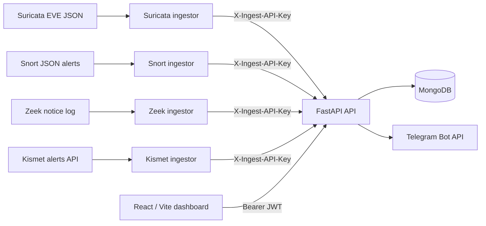

# IntruSight

## Multi-Engine Network Intrusion Detection and Alert Management Platform

IntruSight is a full-stack dashboard for collecting, normalizing, reviewing, and
managing alerts from multiple network intrusion detection systems. It combines a
FastAPI API, MongoDB persistence, Python ingestion workers, and a React dashboard
with role-aware analyst and administrator workflows.

> This was developed as a seven-member final-year university team project. This
> repository preserves the original contributors and Git history and must not be
> interpreted as a solo project.


Additional deployment screenshots and a narrated demo can be added here when a
stable public demo environment is available.

## Project context

The project explored a simpler operational view over alerts produced by
Suricata, Snort, Zeek, and Kismet. The application does not capture packets or
replace an IDS engine: those engines produce events, and IntruSight ingests and
normalizes selected alert fields for investigation.

The team tested custom Suricata and Snort rules as part of the alert pipeline.
IntruSight is not a rule-authoring or rule-distribution system.

## Key features

- Multi-engine alert ingestion with a shared normalized alert model
- Severity mapping, alert filtering, status tracking, notes, and geolocation
- Analyst dashboards, traffic views, reports, threat maps, and Telegram delivery
- Administrator workflows for account approval, log sources, and database maintenance
- Bcrypt password hashing, expiring JWTs, active-account checks, and server-side session invalidation
- API-key authentication dedicated to machine-to-machine alert ingestion
- Simulators for development where an IDS engine, wireless interface, or lab traffic is unavailable

## Architecture



The API currently uses Motor for asynchronous account and maintenance workflows
and PyMongo for the synchronous alert collection.

## Supported IDS engines

| Engine | Input | Integration |
| --- | --- | --- |
| Suricata | EVE JSON alert events | `backend/eve_ingestor.py` |
| Snort | JSON alert output | `backend/snort_ingestor.py` |
| Zeek | JSON notice records | `backend/zeek_ingestor.py` |
| Kismet | Kismet alerts HTTP API | `backend/kismet_ingestor.py` |

Suricata, Snort, Zeek, and Kismet development simulators are included in
`backend/`. They generate synthetic lab data and are not substitutes for
production sensors.

## Technology stack

- Backend: Python, FastAPI, Pydantic, Uvicorn
- Data: MongoDB, Motor, PyMongo
- Security: bcrypt, signed JWT bearer tokens, ingestion API keys
- Frontend: React, Vite, React Router, Axios, Recharts, Leaflet
- Integrations: Telegram Bot API, MaxMind GeoLite2 City
- Testing: pytest, pytest-asyncio, FastAPI TestClient, ESLint, Vite build

## Alert data flow

1. An IDS engine or simulator emits an engine-specific event.
2. Its Python ingestor extracts network identifiers, signature, category, and severity.
3. The ingestor posts the normalized payload to `/api/ingest/alerts` with a dedicated key.
4. FastAPI validates and stores the alert, then optionally enriches IPs with GeoLite2 data.
5. High- and medium-severity events can trigger Telegram notifications.
6. Authenticated analysts retrieve, filter, annotate, and update alerts in the dashboard.

## Setup requirements

- Python 3.12 or newer
- Node.js 22 or newer and npm
- MongoDB 8.x, either local or remote
- Optional: Docker Compose for the included local MongoDB service
- Optional: a current GeoLite2 City database and Telegram/Kismet credentials

## Backend setup

From the repository root:

```bash
python3 -m venv backend/.venv
source backend/.venv/bin/activate
python -m pip install -r backend/requirements.txt
cp .env.example backend/.env
```

Generate independent values for `SECRET_KEY` and `INGEST_API_KEY`:

```bash
openssl rand -hex 32
openssl rand -hex 32
```

Replace the corresponding placeholders in `backend/.env`. Do not reuse either
value for another service.

Start a local MongoDB instance if one is not already available:

```bash
docker compose -f backend/docker-compose.test.yml up -d
```

For a fresh database, create the first administrator interactively:

```bash
cd backend
python create_admin.py
```

The script uses a hidden password prompt so the password is not placed in shell
history.

## Frontend setup

```bash
cd frontend
cp .env.example .env
npm ci
npm run dev
```

The development UI is served at `http://localhost:5173`.

## Environment variables

The root `.env.example` documents backend and ingestor variables. Required
backend variables are:

| Variable | Purpose |
| --- | --- |
| `MONGODB_URL` | MongoDB connection URI |
| `DATABASE_NAME` | Shared MongoDB database name |
| `SECRET_KEY` | JWT signing secret; at least 32 characters |
| `INGEST_API_KEY` | Independent key accepted by the ingestion endpoint |
| `CORS_ORIGINS` | Comma-separated browser origins |

Optional variables configure token expiry, Telegram, Kismet, GeoLite2, log
locations, and the private backup directory. The frontend reads
`VITE_API_BASE` from `frontend/.env`.

Never commit a populated `.env`, a MaxMind license key, a Telegram token, a
Kismet key, or a production MongoDB URI.

## Running locally

Terminal 1:

```bash
cd backend
source .venv/bin/activate
uvicorn main:app --reload --host 127.0.0.1 --port 8000
```

Terminal 2:

```bash
cd frontend
npm run dev
```

Open `http://localhost:5173`. API health and interactive documentation are
available at `http://localhost:8000/health` and `http://localhost:8000/docs`.

To run an ingestor, configure its input path plus `API_URL` and
`INGEST_API_KEY`, then run the relevant script from `backend/`. For example:

```bash
cd backend
source .venv/bin/activate
python eve_ingestor.py
```

## GeoLite2 setup

The database is intentionally not committed. Create a MaxMind account, obtain a
license key, and download a current `GeoLite2-City.mmdb` to
`backend/geoip/GeoLite2-City.mmdb`, or set `GEOIP_DB_PATH` to another private
location. See [MaxMind's GeoLite documentation](https://dev.maxmind.com/geoip/geolite2-free-geolocation-data/)
and [update guidance](https://dev.maxmind.com/geoip/updating-databases/).

MaxMind requires GeoLite users to keep databases current. Geolocation is
approximate and must not be used to identify a household or individual.

## Testing

Backend:

```bash
docker compose -f backend/docker-compose.test.yml up -d
cd backend
source .venv/bin/activate
pytest
```

Frontend:

```bash
cd frontend
npm ci
npm run lint
npm run build
```

## Deployment

No deployment credentials or provider state are stored in this repository.
For deployment:

1. provision MongoDB and set all backend environment variables in the host;
2. restrict `CORS_ORIGINS` to the exact HTTPS frontend origin;
3. run `uvicorn main:app` behind TLS and a production process supervisor;
4. build `frontend/` with `VITE_API_BASE` set to the HTTPS API URL;
5. keep backups and GeoLite data in private, persistent storage; and
6. rotate deployment secrets independently.

Earlier project documentation referenced Netlify and Render deployments. Treat
those URLs as historical unless their owners confirm they are still maintained.

## Limitations

- No self-service email password-reset flow; administrators perform resets.
- No built-in IDS rule editor, packet capture, or sensor lifecycle management.
- Some network-traffic rows are explicitly seeded demo data.
- The ingestors are single-process prototypes without durable queues or replay protection.
- JWTs are stored in browser local storage, so frontend XSS prevention remains important.
- Rate limiting and centralized audit logging are not yet implemented.
- GeoLite2 enrichment is optional and approximate.

## Future improvements

- Durable ingestion queues, idempotency keys, and sensor-specific credentials
- Rate limiting and structured security audit events
- Automated dependency and secret scanning
- End-to-end browser tests and broader authorization tests
- Secure password-reset delivery and optional multi-factor authentication
- Production observability, backup encryption, and restore drills

## Security considerations

The public-repository remediation removed committed credentials, account
backups, archives, and the bundled GeoLite database. Sensitive API routes now
require either a user JWT or the ingestion key. See
[`SECURITY_AUDIT.md`](SECURITY_AUDIT.md) for findings, rotations, validation
results, and the non-destructive Git-history cleanup plan.

This remains an educational prototype. Perform a fresh threat model and
deployment review before using it on production network data.

## Team attribution

IntruSight was built by a seven-member final-year university project team. The
original Git history and contributor attribution are intentionally preserved.
Features represented here were delivered collaboratively; repository ownership
or hosting by one contributor does not imply sole authorship.

## Individual contributions

Git history under the `LongTongg16` identity directly supports the following
primary contributions:

- designing and implementing alert-ingestion and retrieval endpoints;
- building and refining Python ingestors for Suricata, Snort, Zeek, and Kismet;
- normalizing engine-specific fields and severity values;
- adding validation, filtering, status handling, and ingestion error handling;
- creating and refining simulators for unavailable engines or interfaces; and
- connecting the multi-engine alert path to the FastAPI backend.

Broader project notes mention backend migration, MongoDB Atlas, pipeline
testing, dashboard work, and Telegram integration. Those items are not claimed
here as individual ownership because the preserved Git history does not
unambiguously attribute them to this contributor.
